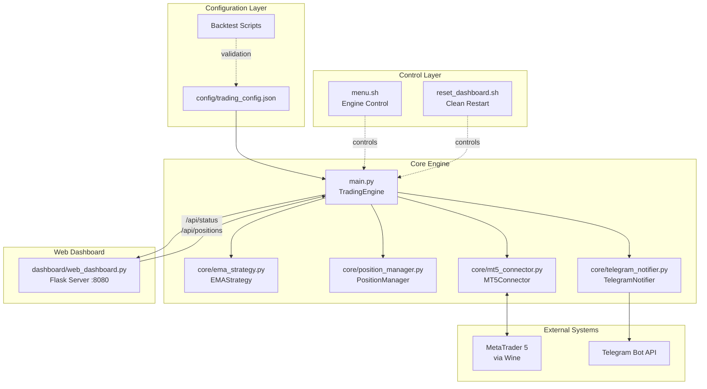
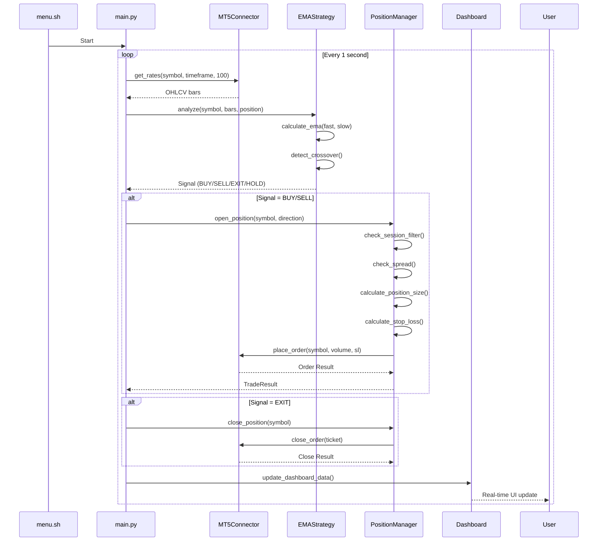
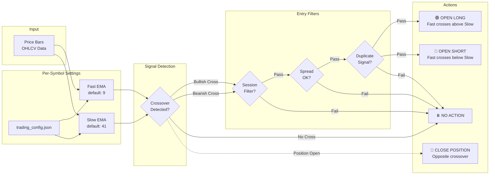

# EMAX Trading Engine

Multi-symbol EMA crossover trading bot for MetaTrader 5 with web dashboard, backtesting framework, and validated configurations.

## 📊 Architecture Overview



## 🔄 Trading Loop Flow



## 📈 EMA Strategy Logic



---

## 🚀 Installation Guide

### Prerequisites

- **Operating System**: Linux (Ubuntu 20.04+, Linux Mint, etc.)
- **MetaTrader 5**: Windows version running via Wine
- **Python**: 3.8+ (both native and Wine Python)
- **Broker Account**: MT5-compatible broker (demo recommended for testing)

### Step 1: System Setup

```bash
# Update system
sudo apt update && sudo apt upgrade -y

# Install Wine (for MT5)
sudo dpkg --add-architecture i386
sudo mkdir -pm755 /etc/apt/keyrings
sudo wget -O /etc/apt/keyrings/winehq-archive.key https://dl.winehq.org/wine-builds/winehq.key

# For Ubuntu 24.04 (Noble)
sudo wget -NP /etc/apt/sources.list.d/ https://dl.winehq.org/wine-builds/ubuntu/dists/noble/winehq-noble.sources

# For Ubuntu 22.04 (Jammy)
sudo wget -NP /etc/apt/sources.list.d/ https://dl.winehq.org/wine-builds/ubuntu/dists/jammy/winehq-jammy.sources

sudo apt update
sudo apt install -y --install-recommends winehq-stable

# Install Python 3
sudo apt install -y python3 python3-pip python3-venv

# Install Xvfb for headless operation (optional, for VPS)
sudo apt install -y xvfb x11vnc
```

### Step 2: Install MT5 under Wine

```bash
# Download MT5 installer
wget https://download.mql5.com/cdn/web/metaquotes.software.corp/mt5/mt5setup.exe

# Install MT5
wine mt5setup.exe /auto

# MT5 will be installed to: ~/.wine/drive_c/Program Files/MetaTrader 5/
```

### Step 3: Install Python in Wine

```bash
# Download Python for Windows
wget https://www.python.org/ftp/python/3.10.11/python-3.10.11-amd64.exe

# Install in Wine
wine python-3.10.11-amd64.exe /quiet InstallAllUsers=1 PrependPath=1

# Verify installation
wine python --version
```

### Step 4: Clone Repository

```bash
# Create project directory
mkdir -p ~/projects/axibot
cd ~/projects/axibot

# Clone the repository
git clone https://github.com/morningtrading/xauusdMULTImt5.git start_EMAX
cd start_EMAX
```

### Step 5: Install Dependencies

```bash
# Install in Wine Python (required for MT5 integration)
wine pip install -r requirements.txt

# Install in native Python (optional, for backtesting without Wine)
pip3 install -r requirements.txt
```

### Step 6: Configure MT5

1. Launch MT5: `wine ~/.wine/drive_c/Program\ Files/MetaTrader\ 5/terminal64.exe`
2. Login to your broker account (demo recommended)
3. Enable algorithmic trading:
   - Tools → Options → Expert Advisors
   - ✅ Allow algorithmic trading
   - ✅ Allow DLL imports
   - ✅ Allow WebRequest for listed URL

### Step 7: Configure Trading Settings

Edit `config/trading_config.json`:

```json
{
    "account": {
        "demo_only": true,                    // Safety lock
        "max_margin_per_trade_usd": 20.0,    // Max margin per position
        "position_size_type": "symbol_specific"
    },
    "symbols": {
        "enabled": ["XAUUSD", "US2000", "SP500ft", "NAS100ft", "GER40ft"],
        "settings": {
            "XAUUSD": {
                "timeframe": "H1",
                "fast_ema": 5,
                "slow_ema": 55,
                "volume": 0.01            // 0.01 lots for XAUUSD
            },
            "US2000": {
                "timeframe": "H1",
                "fast_ema": 15,
                "slow_ema": 40,
                "volume": 0.1             // 0.1 lots for indices
            }
        }
    }
}
```

---

## 🎮 Usage

### Using Menu System (Recommended)

```bash
# Make menu executable (first time only)
chmod +x ./menu.sh

# Run interactive menu
./menu.sh

# Or use direct commands:
./menu.sh start        # Start engine
./menu.sh stop         # Stop engine
./menu.sh status       # Check status
./menu.sh logs         # View logs (live)
./menu.sh reset        # Clean restart
```

### Manual Operation

```bash
# Start engine
wine python main.py &

# Access dashboard
firefox http://localhost:8080

# Stop engine
pkill -f "python.*main.py"
```

### Reset Dashboard

```bash
# Make reset script executable (first time only)
chmod +x ./reset_dashboard.sh

# Clean restart
./reset_dashboard.sh
```

---

## 📁 Project Structure

```
start_EMAX/
├── README.md                           # This file
├── requirements.txt                    # Python dependencies
├── menu.sh                             # Engine control script ⭐
├── reset_dashboard.sh                  # Clean restart script
│
├── main.py                             # 🚀 Engine entry point
│
├── config/
│   └── trading_config.json             # ⚙️ Main configuration
│
├── core/                               # Core trading logic
│   ├── __init__.py
│   ├── ema_strategy.py                 # EMA crossover strategy
│   ├── mt5_connector.py                # MT5 API wrapper
│   ├── position_manager.py             # Position & risk management
│   └── telegram_notifier.py            # Telegram alerts
│
├── dashboard/                          # Web interface
│   ├── __init__.py
│   └── web_dashboard.py                # Flask dashboard (port 8080)
│
├── tests/                              # Unit tests
│   ├── __init__.py
│   └── test_ema_strategy.py
│
├── logs/                               # Log files (auto-created)
│
├── backtest_ema_optimizer.py          # 🔬 Backtest optimizer
├── backtest_validation.py              # Validation on unseen data
├── backtest_comparison.py              # Original vs optimized
├── backtest_even_months.py             # Even months analysis
├── backtest_odd_months.py              # Odd months analysis
├── calculate_margin.py                 # Margin calculator
│
└── final_backtest_summary.txt          # 📊 Validation findings
```

---

## ⚙️ Configuration Reference

### Trading Symbols

Current configuration (validated on Jan 2025 data):

| Symbol   | Timeframe | Fast EMA | Slow EMA | Volume | Status    | Jan 2025 PnL |
|----------|-----------|----------|----------|--------|-----------|--------------|
| XAUUSD   | H1        | 5        | 55       | 0.01   | ✅ Enabled | +70.68       |
| XAGUSD   | H1        | 18       | 60       | 0.01   | ❌ Disabled| -19.68       |
| US2000   | H1        | 15       | 40       | 0.1    | ✅ Enabled | +130.86      |
| SP500ft  | M15       | 19       | 55       | 0.1    | ✅ Enabled | +71.17       |
| NAS100ft | M5        | 12       | 60       | 0.1    | ✅ Enabled | -804.43      |
| GER40ft  | H1        | 10       | 30       | 0.1    | ✅ Enabled | +1063.00     |

**Total Jan 2025 PnL: +531.28** (validated on unseen data)

### Key Settings

```json
{
    "account": {
        "demo_only": true,                          // Must be true for safety
        "max_margin_per_trade_usd": 20.0,          // Max $20 margin per position
        "max_daily_loss_percent": 75.0,            // Stop trading at 75% loss
        "position_size_type": "symbol_specific"    // Use per-symbol volumes
    },
    
    "stop_loss": {
        "type": "fixed",                           // fixed or atr
        "fixed_percent_of_margin": 50.0            // SL = 50% of margin ($10 on $20)
    },
    
    "session_filter": {
        "enabled": true,                           // Trade only during sessions
        "london_open_utc": "08:00",
        "ny_close_utc": "20:00"
    },
    
    "dashboard": {
        "web_port": 8080,                          // Dashboard port
        "auto_refresh_seconds": 5                  // Update interval
    }
}
```

---

## 🧪 Backtesting

### Run Backtest Optimizer

```bash
# Optimize EMA parameters for date range
wine python backtest_ema_optimizer.py

# Results saved to: backtest_results_YYYYMMDD_HHMMSS.csv
```

### Validate on Unseen Data

```bash
# Test optimized settings on validation period
wine python backtest_validation.py

# Compare original vs optimized
wine python backtest_comparison.py
```

### Calculate Margin Requirements

```bash
# Check margin for current position sizes
wine python calculate_margin.py
```

### Analysis Scripts

```bash
# Even months (Feb, Apr, Jun, Aug, Oct, Dec)
wine python backtest_even_months.py

# Odd months (Jan, Mar, May, Jul, Sep, Nov)
wine python backtest_odd_months.py
```

---

## 📊 Dashboard

Access the web dashboard at: **http://localhost:8080**

### Features

- **Real-time Market Overview**: Live prices, EMA values, trend direction
- **Open Positions**: Active trades with P&L
- **Account Status**: Balance, equity, margin usage
- **Recent Signals**: Last 20 trading signals
- **System Controls**: Enable/disable trading, change direction
- **Connection Status**: MT5 connection, engine status

### API Endpoints

```bash
# Get status
curl http://localhost:8080/api/status

# Get positions
curl http://localhost:8080/api/positions

# Enable trading
curl -X POST http://localhost:8080/api/trade/enable

# Disable trading
curl -X POST http://localhost:8080/api/trade/disable

# Set direction
curl -X POST http://localhost:8080/api/direction -d '{"direction": "long"}'

# Panic button (close all)
curl -X POST http://localhost:8080/api/panic
```

---

## 🔧 Troubleshooting

### Engine Won't Start

```bash
# Check if MT5 is running
ps aux | grep terminal64

# Check if port 8080 is available
lsof -i :8080

# View logs
tail -f logs/engine.log
```

### MT5 Connection Failed

1. Ensure MT5 terminal is running: `wine ~/.wine/drive_c/Program\ Files/MetaTrader\ 5/terminal64.exe`
2. Check MT5 settings: Tools → Options → Expert Advisors → Allow algorithmic trading
3. Verify account is logged in
4. Check `test_mt5_import.py`: `wine python test_mt5_import.py`

### Dashboard Not Loading

```bash
# Check if Flask is running
netstat -tulpn | grep 8080

# Restart dashboard
./reset_dashboard.sh
```

### Wine Errors

```bash
# Suppress Wine debug messages
wine python main.py 2>/dev/null

# Or redirect to file
wine python main.py 2>wine_errors.log
```

---

## 🧪 Validation Results

The current configuration has been validated on **January 2025** (unseen data):

### Performance Summary

- **Total PnL**: +531.28 points
- **Profitable Symbols**: 4/5 (80%)
- **Best Performer**: GER40ft (+1063.00)
- **Worst Performer**: NAS100ft (-804.43)

### Key Findings

1. **Original Config Outperforms Optimized** (+531 vs -425 on validation)
2. **Simpler Parameters = More Robust** across market regimes
3. **Walk-Forward Validation is Critical** to avoid overfitting

See `final_backtest_summary.txt` for detailed analysis.

---

## 📝 Important Notes

### Safety

- ⚠️ **ALWAYS run on DEMO account first**
- ⚠️ `demo_only: true` prevents live trading
- ⚠️ Start with minimum position sizes
- ⚠️ Monitor for at least 1 week before going live

### Position Sizing

- XAUUSD: 0.01 lots (min volume = 0.01)
- Indices (US2000, SP500ft, NAS100ft, GER40ft): 0.1 lots (min volume = 0.1)
- XAGUSD: Disabled (margin exceeds $10 limit)

### Margin Requirements

With current settings:
- XAUUSD: ~$10 margin per position
- Indices: ~$0.50-$5 margin per position
- Total if all trade simultaneously: ~$20-30

### Backtesting Lessons

1. **Historical optimization ≠ Future performance**
2. **Validation on unseen data is mandatory**
3. **Simpler strategies often outperform complex ones**
4. **Market regimes change** - be prepared to adapt

---

## 📚 Additional Resources

- **MT5 Documentation**: https://www.mql5.com/en/docs
- **MetaTrader5 Python Package**: https://pypi.org/project/MetaTrader5/
- **Flask Documentation**: https://flask.palletsprojects.com/
- **Wine HQ**: https://www.winehq.org/

---

## 🤝 Contributing

This is a personal trading system. Fork at your own risk.

---

## ⚖️ Disclaimer

**FOR EDUCATIONAL PURPOSES ONLY**

This software is provided "as is" without warranty of any kind. Trading carries substantial risk of loss. Past performance does not guarantee future results. The developers are not responsible for any financial losses incurred through use of this software.

**ALWAYS**:
- Test on demo accounts first
- Use proper risk management
- Never risk more than you can afford to lose
- Understand the code before running it

---

## 📜 License

Private use only. Not licensed for redistribution.

---

## 📧 Support

For issues and questions, refer to the troubleshooting section above or review the code documentation.

**Version**: 1.0.0  
**Last Updated**: January 23, 2026  
**Status**: Production-ready (validated configuration)
