# EMAX Trading Engine

A multi-symbol EMA crossover trading engine for MetaTrader 5.

## Architecture Overview


## Trading Loop Flow

```mermaid
sequenceDiagram
    participant Loop as Main Loop
    participant MT5 as MT5Connector
    participant EMA as EMAStrategy
    participant PM as PositionManager
    participant Dash as Dashboard

    loop Every 1 second
        Loop->>MT5: get_rates(symbol, M5, 100)
        MT5-->>Loop: OHLCV bars
        Loop->>EMA: analyze(symbol, bars)
        EMA-->>Loop: Signal (BUY/SELL/HOLD)
        
        alt Signal = BUY/SELL
            Loop->>PM: open_position(symbol, direction)
            PM->>MT5: place_order()
            MT5-->>PM: Result
        end
        
        alt Signal = EXIT
            Loop->>PM: close_position(symbol)
            PM->>MT5: close_order()
        end
        
        Loop->>Dash: update market_overview
    end
```

## EMA Strategy Logic

```mermaid
flowchart LR
    subgraph Input
        P[Price Bars]
    end

    subgraph Calculate
        F[Fast EMA 9]
        S[Slow EMA 41]
    end

    subgraph Detect
        XO{Crossover?}
    end

    subgraph Output
        BUY[🟢 BUY Signal]
        SELL[🔴 SELL Signal]
        HOLD[⏸️ HOLD]
    end

    P --> F
    P --> S
    F --> XO
    S --> XO
    XO -->|Fast > Slow & Prev Fast < Prev Slow| BUY
    XO -->|Fast < Slow & Prev Fast > Prev Slow| SELL
    XO -->|No Cross| HOLD
```



## Quick Start

```bash
# 1. Start MT5 under Wine
wine terminal64.exe &

# 2. Run engine
./wine_python.sh main.py

# 3. Open dashboard
# http://localhost:8080
```

## Reset Dashboard

```bash
./reset_dashboard.sh
```

This stops the engine, clears logs, and restarts with a clean session.

## Configuration

Edit `config/trading_config.json`:

| Setting | Description | Default |
|---------|-------------|---------|
| `symbols.enabled` | Active trading symbols | XAUUSD, XAGUSD, SP500... |
| `strategy.fast_ema_period` | Fast EMA period | 9 |
| `strategy.slow_ema_period` | Slow EMA period | 41 |
| `strategy.direction` | Trade direction | both |
| `account.demo_only` | Safety lock for demo | true |

## File Structure

```
start_EMAX/
├── main.py                 # Engine entry point
├── config/
│   └── trading_config.json # All settings
├── core/
│   ├── ema_strategy.py     # EMA crossover logic
│   ├── mt5_connector.py    # MT5 communication
│   ├── position_manager.py # Order management
│   └── telegram_notifier.py# Alerts
└── dashboard/
    └── web_dashboard.py    # Flask web UI
```
